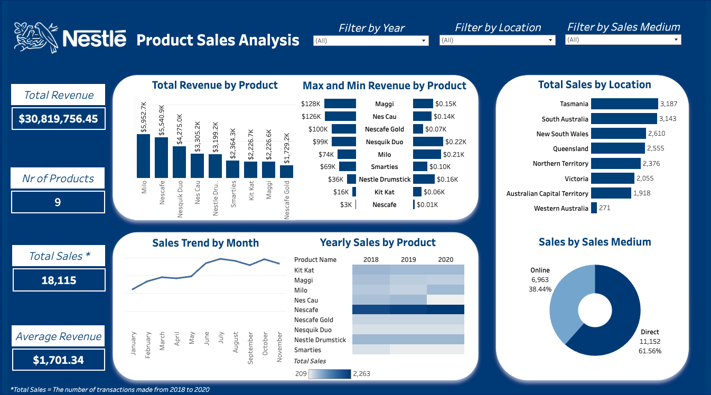

# Nestlé Australia Sales Analysis

## Project Background
Nestlé has been a global leader in food and beverages for over 150 years, offering products such as dairy, confectionery, beverages, and prepared meals. As a data analyst at Nestlé Australia, I analyzed sales data for 9 Nestlé products from 2018 to 2020 to provide management with actionable insights to support strategic decision-making, and capitalize on growth opportunities.

This analysis focuses on the following key areas:
- **Sales Trend by Seasonality**: Examining month-over-month (MoM) and year-over-year (YoY) sales trends to identify demand fluctuations.
- **Dimensional Segmentation of Sales**: Analyzing sales by state, product, and sales medium to refine targeting strategies.
- **Product Performancen**: Identifying top-performing products and their contribution to overall revenue to guide resource allocation.

The SQL queries used to inspect and clean the data for this analysis can be found [here](https://github.com/tructoldmethat/Nestle-Australia-Sales-Analysis/blob/main/nestlesales.sql). 

An interactive Tableau dashboard for exploring sales trends is available [here](https://public.tableau.com/app/profile/truc.huynh3135/viz/NestlSalesAnalysis/NestleDashboard).

---

## Executive Summary

### Overview of Findings
From 2018 to 2020, Nestlé generated a total revenue of **$30,819,756.45** from 9 products: Maggi, Nescau, Nescafé Gold, Nesquik Duo, Milo, Smarties, Nestlé Drumstick, Kit Kat, and Nescafé. Keyinsights are derived from this analysis as below:
- **Milo and Nesquik Duo** are the leading contributors to revenue, with Milo generating the highest revenue share (23%) while **Nescafé Gold** has the lowest contribution (5%), indicating room for growth or reevaluation of its market strategy.
- **Direct sales** constituted 61.56% of transactions, underscoring their importance in boosting revenue.
- **Tasmania** and **South Australia** dominated in sales volume.

---

## Insights Deep Dive

### Sales Trend by Seasonality
- **Peak Months**: Sales consistently peaked mid-year (June–August), with notable highs in July and October. The highest sales was recorded in October 2018 and July 2019 with 672 sales. July aligns with Australia's cold season and mid-year holidays, which is a period that most companies in Australia target for increasing sales by boosting more promotional offers. October marks the start of holiday preparations, boosting sales.

### Dimensional Segmentation of Sales
- **Top Regions**: **Tasmania** recored 3,187 units sold, driven by Milo and Nescafé (18% revenue share each). Following closely is **South Australia** with 3,143 sales recorded.  
- **Underperforming Region**: Western Australia recorded the lowest sales at 271 units, indicating the need for targeted initiatives.
- **Sales Channels**: Direct Sales accounted for 61.56% (11,152), emphasizing their critical role while 38.44% of sales (6,963) were online, presenting significant growth opportunities.
- **Product Performance by Channel**: Nescafé achieved the highest sales across both direct and online channels. Following Nescafé, Nestlé Drumstick recorded the second-highest in-store sales, while KitKat excelled in online sales.

### Product Performance
- **Top Products**: Milo, Nescafé, and Nesquik Duo collectively contributed over 50% of total revenue. Nescafé demonstrated high demand with consistent year-over-year sales driven by its low price point.
- **Underperforming Products**: Kit Kat and Maggi reported the lowest revenues at $2.2M and $1.7M, respectively, indicating potential areas for improvement in sales strategies.
- **Chocolate Beverage Preferences**: Milo outperformed Nescau, with its sales increasing steadily year-round.

---

## Recommendations

- **Maximize High-Revenue Products through Targeted Marketing**: Run focused campaigns for **Milo**, **Nescafé**, and **Nesquik Duo**, highlighting their unique qualities. Expand availability through premium retail channels and influencer partnerships to boost brand awareness.

- **Revitalize Underperforming Products through Product Innovation**: Reposition **Kit Kat** with new flavors or limited-edition packaging. Launch seasonal promotions and in-store activations to spark interest and drive sales or leverage product placement in movies or videos from content creator to showcase the product in daily context.

- **Focus on High-Performing Regions** by increasing marketing efforts in **Tasmania & South Australia** through regional ads and retail partnerships. 

- **Strengthen E-Commerce**  
   - **Digital Marketing**: Invest in targeted online advertising, offering exclusive discounts and subscription models to engage digital consumers.  
   - **Improve User Experience**: Optimize the online shopping experience with fast delivery options and personalized product recommendations.

- **Seasonal Promotions**  
   - **Holiday Campaigns**: Launch limited-time holiday editions and gift bundles to address the typical December sales decline.  
   - **Summer Push**: Plan early summer promotions and partnerships to capitalize on increased demand from January onwards.

