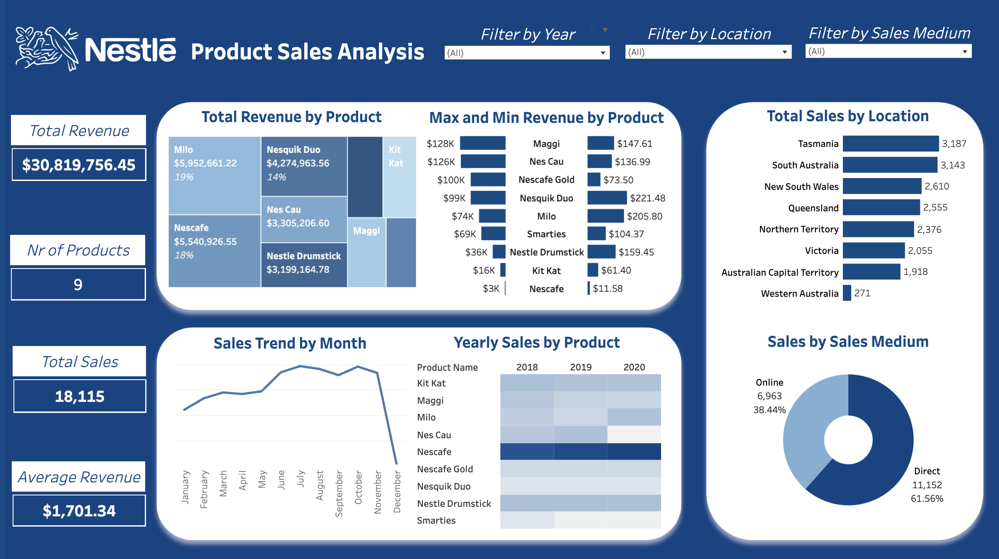

# Nestlé Australia Sales Analysis

## Project Background
Nestlé has been a global leader in food and beverages for over 150 years, offering products such as dairy, confectionery, beverages, and prepared meals. As a data analyst at Nestlé Australia, I analyzed sales data for 9 Nestlé products from 2018 to 2020 to provide management with actionable insights to optimize operations, enhance decision-making, and capitalize on growth opportunities.

This analysis focuses on the following key areas:
- **Seasonality**: Examining month-over-month (MoM) and year-over-year (YoY) sales trends to identify demand fluctuations.
- **Dimensional Segmentation**: Analyzing sales by state, product, and sales medium to refine targeting strategies.
- **Distribution**: Identifying top-performing products and their contribution to overall revenue to guide resource allocation.

The SQL queries used to inspect and clean the data for this analysis can be found [here](https://github.com/tructoldmethat/Nestle-Australia-Sales-Analysis/blob/main/nestlesales.sql). 

An interactive Tableau dashboard for exploring sales trends is available [here](https://public.tableau.com/app/profile/truc.huynh3135/viz/NestlSalesAnalysis/NestleDashboard).

---

## Executive Summary

### Overview of Findings
From 2018 to 2020, Nestlé generated a total revenue of **$30,819,756.45** from 9 products: Maggi, Nescau, Nescafé Gold, Nesquik Duo, Milo, Smarties, Nestlé Drumstick, Kit Kat, and Nescafé. Keyinsights are derived from this analysis as below:
1. **Milo** was the top revenue contributor, accounting for 19% of total sales. Although Nescafé ranked second, it demonstrated the most consistent and robust sales performance.
2. **Direct sales** constituted 61.56% of transactions, underscoring their importance in boosting revenue.
3. **Tasmania** and **South Australia** dominated in sales volume.

---

## Insights Deep Dive

### Sales Trend by Seasonality
- **Peak Months**: Sales consistently peaked mid-year (June–August), with notable highs in July and October. The highest sales was recorded in October 2018 and July 2019 with 672 sales). July aligns with Australia's cold season and mid-year holidays, which is a period that most companies in Australia target for increasing sales by boosting more promotional offers. October marks the start of holiday preparations, boosting sales.
- **Year-End Decline**: December showed a recurring sales dip across all three years, recovering in January and climbing steadily through summer. This highlights a potential gap in holiday season strategies.

### Dimensional Segmentation of Sales
- **Top Regions**:
    - **Tasmania**: 3,187 units sold, driven by Milo and Nescafé (18% revenue share each) while **South Australia** recorded 3,143 units sold.  
- **Underperforming Region**: Western Australia recorded the lowest sales at 271 units, indicating the need for targeted initiatives.
- **Sales Channels**:
  - **Direct Sales**: 61.56% of transactions (11,152), emphasizing their critical role.
  - **E-Commerce**: 38.44% of transactions (6,963), presenting significant growth opportunities.
- **Product Performance by Channel**:
  - Family-oriented products (e.g., Milo, Nesquik Duo) dominated direct sales, contributing 18% and 25% of total revenue, respectively.
  - Adult-oriented products like Nescafé led in online sales, accounting for 47% of revenue.

### Distribution Analysis
- **Top Products**:
  - Milo, Nescafé, and Nesquik Duo collectively contributed over 50% of total revenue.
  - Nescafé demonstrated high demand with consistent year-over-year sales driven by its low price point.
- **Underperforming Products**:
  - Kit Kat and Maggi reported the lowest revenues at $3,199,164.78 and $128, respectively, indicating potential areas for intervention.
- **Chocolate Beverage Preferences**: Milo outperformed Nescau, with its sales increasing steadily year-round, unlike Nescau, which declined.

---

## Recommendations

1. **Enhance High-Revenue Products**: 
   - Allocate additional marketing and distribution resources to Milo, Nescafé, and Nesquik Duo to sustain their market leadership.

2. **Revitalize Underperforming Products**: 
   - Implement promotional campaigns and innovative positioning strategies for Kit Kat and Maggi to boost sales.

3. **Prioritize High-Performing Regions**: 
   - Invest further in Tasmania and South Australia while addressing barriers in Western Australia to unlock latent potential.

4. **Leverage Digital Channels**: 
   - Strengthen e-commerce infrastructure and marketing to capitalize on the growing digital consumer base.

5. **Seasonal Strategies**: 
   - Develop targeted promotional initiatives for December to counteract declining year-end sales.

---

This analysis provides a comprehensive understanding of Nestlé Australia's revenue trends and offers actionable insights to support strategic decision-making.
